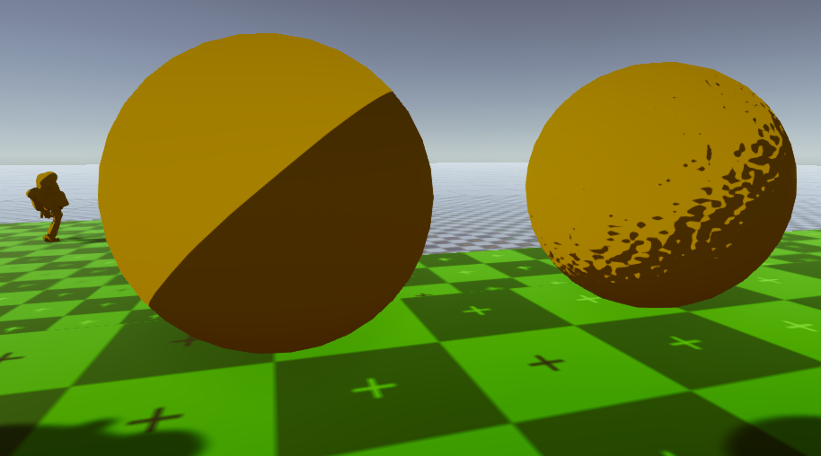

# Toon shader using normals 

Shader inspired from [Ronja's tutorials)[https://www.ronja-tutorials.com/2018/10/20/stepped-toon.html]. 
I simply added support for normal maps, which can give really nice effects, if you like manga style.

